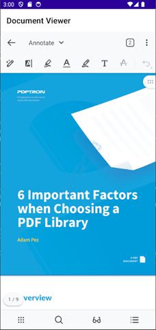
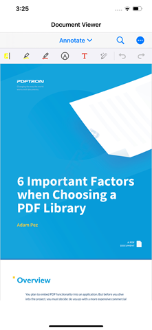

# Apryse Mobile SDK - .NET MAUI sample

The .NET Multi-platform App UI (.NET MAUI) is a cross-platform framework for building native mobile and desktop apps with C# and XAML. It is open-source and is the evolution of `Xamarin.Forms`. Using .NET MAUI, multi-platform apps can be developed using a single project that can contain platform-specfic code and resources.

Both the [Android](https://apryse.com/products/mobile-sdk/android) and [iOS](https://apryse.com/products/mobile-sdk/ios) components of the [Apryse Mobile SDK](https://apryse.com/products/mobile-sdk) can be implemented into a .NET MAUI code-base by adding the respective [PDFTron .Nuget packages](https://www.nuget.org/profiles/PDFTroner) to the project and leveraging the C# code to implement the native views for each platform.

This sample implements a custom `DocumentViewerControl` .NET MAUI control that handles displaying the native view on the Android and iOS mobile platforms, depending on the platform targetted by the project.

For Android, the [`DocumentView2`](https://sdk.apryse.com/api/xamarinandroid/tools/api/pdftron.PDF.Controls.DocumentView2.html) class from the Apryse [PDFTron.Android.Tools](https://www.nuget.org/packages/PDFTron.Android.Tools) NuGet package is utilized.

For iOS, the [`PTTabbedDocumentViewController`](https://sdk.apryse.com/api/ios/Classes/PTTabbedDocumentViewController.html) class from the Apryse [PDFTron.iOS.Tools](https://www.nuget.org/packages/PDFTron.iOS.Tools) NuGet package is utilized.

 Android Native View | iOS Native View
|---|---|
|  | 

## The DocumentViewerControl cross-platform control

The `DocumentViewerControl` control is derived from the [`View`](https://learn.microsoft.com/en-us/dotnet/api/microsoft.maui.controls.view) control, which represents a visual element used to arrange layouts and views on the screen. 

The code for this control can be found under [Controls\DocumentViewerControl.cs](DocumentViewer/Controls/DocumentViewerControl.cs)

It provides a public API that is accessed by its handler and control consumers. 

This control is designed to provide two public properties:
* `Uri`: A string value that contains the URI for the document to be loaded in the viewer
* `Password`: A string value that contains the password (if any) to open the document

The `DocumentViewerControl` also has two public methods:
* `Open()`: Loads the document by invoking the platform-specific `OpenDocument()` with the current assigned values for `Uri` and `Password`
* `Open(string uri, string password)`: Sets the values for `Uri` and `Password` then calls `Open()`

## The DocumentViewerControl handler

The `DocumentViewerHandler` is a partial class whose implementation will depend on which platform is being targetted. 

It uses a conditional `using` to initialize the `platformView` native view for the specific platform.

```c#
#if IOS
using PlatformView = DocumentViewer.Platforms.iOS.DocumentViewerNativeView;
#elif ANDROID
using PlatformView = DocumentViewer.Platforms.Android.DocumentViewerNativeView;
#elif (NETSTANDARD || !PLATFORM) || (NET6_0_OR_GREATER && !IOS && !ANDROID)
using PlatformView = System.Object;
#endif
```
In addition, the handler uses the `PropertyMapper` and `CommandMapper` classes to connect each member of the ``DocumentViewerControl``'s public API to a generic static `Action`. 

Each specific platform will then have a partial class that gives the specific implementation of every mapped `Action`. 

For this sample:
* Main partial handler: [Handlers\DocumentViewerHandler.cs](DocumentViewer/Handlers/DocumentViewerHandler.cs)
* Android implementation: [Handlers\DocumentViewerHandler.Android.cs](DocumentViewer/Handlers/DocumentViewerHandler.Android.cs)
* iOS implmentation: [Handlers\DocumentViewerHandler.iOS.cs](DocumentViewer/Handlers/DocumentViewerHandler.iOS.cs)

To ensure the correct loading of partial handler files based on the platform, the project uses filename-based multi-targeting, configured by adding the following XML to the project file, as children of the <project> node.

```XML
<!-- Android -->
<ItemGroup Condition="$(TargetFramework.StartsWith('net9.0-android')) != true">
    <Compile Remove="**\*.Android.cs" />
    <None Include="**\*.Android.cs" Exclude="$(DefaultItemExcludes);$(DefaultExcludesInProjectFolder)" />
</ItemGroup>

<!-- iOS -->
<ItemGroup Condition="$(TargetFramework.StartsWith('net9.0-ios')) != true">
    <Compile Remove="**\*.iOS.cs" />
    <None Include="**\*.iOS.cs" Exclude="$(DefaultItemExcludes);$(DefaultExcludesInProjectFolder)" />
</ItemGroup>
```

## Android

The PDFNet library is first initialized in [Platforms\Android\MainActivity.cs](DocumentViewer/Platforms/Android/MainActivity.cs) by calling `pdftron.PDF.Tools.Utils.AppUtils.InitializePDFNetApplication(this)` in the `OnCreate()` method.

In the [Platforms\Android\DocumentViewerNativeView.cs](DocumentViewer/Platforms/Android/DocumentViewerNativeView.cs), the `DocumentView2` is created and added to the `View` using the mapped `DocumentViewerControl` control properties.

```c#
public DocumentViewerNativeView(Context context, DocumentViewerControl documentViewerControl) : base(context)
{
    _context = context;
    _documentViewerControl = documentViewerControl;

    SetBackgroundColor(Color.Black);

    // Create a RelativeLayout for sizing the document viewer
    RelativeLayout relativeLayout = new RelativeLayout(_context)
    {
        LayoutParameters = new CoordinatorLayout.LayoutParams(LayoutParams.MatchParent, LayoutParams.MatchParent)
        {
            Gravity = (int)GravityFlags.Center
        }
    };

    // Create DocumentView and position it in the RelativeLayout
    _documentView = new DocumentView2(context)
    {
        LayoutParameters = new RelativeLayout.LayoutParams(LayoutParams.MatchParent, LayoutParams.MatchParent)
    };

    // Add to the layouts
    relativeLayout.AddView(_documentView);
    AddView(relativeLayout);
}
```

The `Uri` and `Password` properties are managed as follows:

```c#
public void UpdateUri()
{
    if (!string.IsNullOrEmpty(_documentViewerControl.Uri))
    {
        _documentView.SetDocumentUri(Uri.Parse(_documentViewerControl.Uri));
    }
}

public void UpdatePassword()
{
    if (!string.IsNullOrEmpty(_documentViewerControl.Password))
    {
        _documentView.SetPassword(_documentViewerControl.Password);
    }
}
```

The `OpenDocument()` command is implemented as follows:

```c#
public void OpenDocument()
{
    if (string.IsNullOrEmpty(_documentViewerControl.Uri))
    {
        return;
    }

    _documentView.SetViewerConfig(GetConfig());
    if (Context != null)
        _documentView.SetSupportFragmentManager(GetManager(Context));

    FragmentManager? GetManager(Context context)
    {
        FragmentManager? childManager = null;
        if (context is FragmentActivity)
        {
            var activity = context as FragmentActivity;
            var manager = activity?.SupportFragmentManager;

            var fragments = manager?.Fragments;
            if (fragments?.Count > 0)
                childManager = fragments[0].ChildFragmentManager;
            if (childManager != null)
                return childManager;
        }
        return childManager;
    }

    ViewerConfig? GetConfig()
    {
        var toolmanagerBuilder = ToolManagerBuilder.From()?.SetAutoSelect(true);
        var builder = new ViewerConfig.Builder();
        var config = builder
            ?.MultiTabEnabled(true)
            ?.FullscreenModeEnabled(false)
            ?.UseSupportActionBar(false)
            ?.ToolManagerBuilder(toolmanagerBuilder)
            ?.SaveCopyExportPath(this.Context?.FilesDir?.AbsolutePath)
            ?.Build();
        return config;
    }
}
```

## iOS

The PDFNet library is first initialized in [Platforms\iOS\AppDelegate.cs](DocumentViewer/Platforms/iOS/AppDelegate.cs) by calling `pdftron.PDFNet.Initialize("")` in the `FinishedLaunching()` method.

In the [Platforms\iOS\DocumentViewerNativeView.cs](DocumentViewer/Platforms/iOS/DocumentViewerNativeView.cs), the `PTTabbedDocumentViewController` is created and added to the `View` using the mapped `DocumentViewerControl`'s properties.

```c#
public DocumentViewerNativeView(DocumentViewerControl documentViewerControl)
{
    _documentViewerControl = documentViewerControl;

    // Create the Mutli-Tab Document View Controller
    mTabViewController = new PTTabbedDocumentViewController();

    // Add to a navigation controller
    UINavigationController navigationController = new UINavigationController(mTabViewController);
    
    // Add the navigation controller to the current view            
    if (navigationController.View != null)
    {
        AddSubview(navigationController.View);

        // Define the layout for the navigation controller's view
        navigationController.View.Frame = Bounds;
        navigationController.View.AutoresizingMask = UIViewAutoresizing.FlexibleWidth | UIViewAutoresizing.FlexibleHeight;
    }
}
```

The `Uri` and `Password` properties are managed as follows:

```c#
public void UpdateUri()
{
    if (string.IsNullOrEmpty(_documentViewerControl.Uri) || _uri.ToString() == _documentViewerControl.Uri)
        return;
    _uri = new Uri(_documentViewerControl.Uri);
}

public void UpdatePassword()
{
    if (_password == _documentViewerControl.Password)
        return;
    _password = _documentViewerControl.Password;
}
```

The `OpenDocument()` command is implemented as follows:

```c#
public void OpenDocument()
{
    mTabViewController.OpenDocumentWithURL(_uri, _password);
}
```

## Document Viewer MVVM and XAML

 The project implements an [Model-View-ViewModel (MVVM)](https://learn.microsoft.com/en-us/dotnet/architecture/maui/mvvm) pattern.

The [Models\DefaultDocument.cs](DocumentViewer/Models/DefaultDocument.cs) model encapsulates the default document that is loaded in the app, which can be found [here](https://pdftron.s3.amazonaws.com/downloads/pl/PDFTRON_mobile_about.pdf)

The main view for the app is [Views\DocumentViewerPage.xaml](DocumentViewer/Views/DocumentViewerPage.xaml). In addition to defining how the component's layout, the [Views\DocumentViewerPage.xaml,cs](DocumentViewer/Views/DocumentViewerPage.xaml.cs) also calls the `DisconnectHandler()` method in the `OnPageUnloaded()` handler.

```c#
void OnPageUnloaded(object sender, EventArgs e)
{
    documentViewer.Handler?.DisconnectHandler();
}
```

The [ViewModels\DocumentViewerViewModel.cs](DocumentViewer/ViewModels/DocumentViewerViewModel.cs) view model connects the default document data to the view and handles any changes to the properties.

## Getting a license key

The trial of the Apryse Mobile SDK does not require a trial key. A commercial license key is required for use in a production environment. Please [contact sales](https://apryse.com/form/contact-sales) to purchase a commerical key or if you need any other license key assistance.

## Deploy and Run

### Android

Open the solution in an IDE like [JetBrains Rider](https://www.jetbrains.com/help/rider/MAUI.html#run_debug) or [Microsoft Visual Studio](https://learn.microsoft.com/en-us/dotnet/maui/android/device/setup?view=net-maui-9.0) then build, deploy, and run the project to an Android device or emulator.

### iOS

If using an IDE supported on Mac OS (e.g. [JetBrains Rider](https://www.jetbrains.com/help/rider/MAUI.html#run_debug)), open the solution then build, deploy, and run the project to the Xcode iOS simulator or a connected iOS device.

Otherwise, if the solution is opened on an IDE running on Windows, a Mac machine needs to be paired to the IDE and an active Apple developer account needs to generate a provisioning profile in order to build, deploy, and run the project to an iOS device connected to the Mac machine or remotely to the Xcode iOS simulator.


## See Also
* [Apryse Android SDK: DocumentView2](https://sdk.apryse.com/api/xamarinandroid/tools/api/pdftron.PDF.Controls.DocumentView2.html)
* [Apryse iOS SDK: PTTabbedDocumentViewController](https://sdk.apryse.com/api/ios/Classes/PTTabbedDocumentViewController.html)
* [Apryse PDFTron NuGets: PDFTron.Android.Tools](https://www.nuget.org/packages/PDFTron.Android.Tools)
* [Apryse PDFTron NuGets: PDFTron.iOS.Tools](https://www.nuget.org/packages/PDFTron.iOS.Tools)
* [.NET MAUI: Create a custom control using handlers](https://learn.microsoft.com/en-us/dotnet/maui/user-interface/handlers/create)
* [.NET MAUI: Configure multi-targeting](https://learn.microsoft.com/en-us/dotnet/maui/platform-integration/configure-multi-targeting)
* [.NET MAUI: Model-View-ViewModel (MVVM)](https://learn.microsoft.com/en-us/dotnet/architecture/maui/mvvm)
* [.NET MAUI: Set up Android device for debugging](https://learn.microsoft.com/en-us/dotnet/maui/android/device/setup)
* [.NET MAUI: Android Emulator](https://learn.microsoft.com/en-us/dotnet/maui/android/emulator)
* [.NET MAUI: Pair to Mac for iOS development](https://learn.microsoft.com/en-us/dotnet/maui/ios/pair-to-mac)
* [JetBrains Rider: Languages and frameworks: MAUI](https://www.jetbrains.com/help/rider/MAUI.html)
* [JetBrains Rider: Run and debug MAUI and Xamarin projects on macOS](https://www.jetbrains.com/help/rider/Run_Debug_Configuration_Xamarin_Mac.html)
